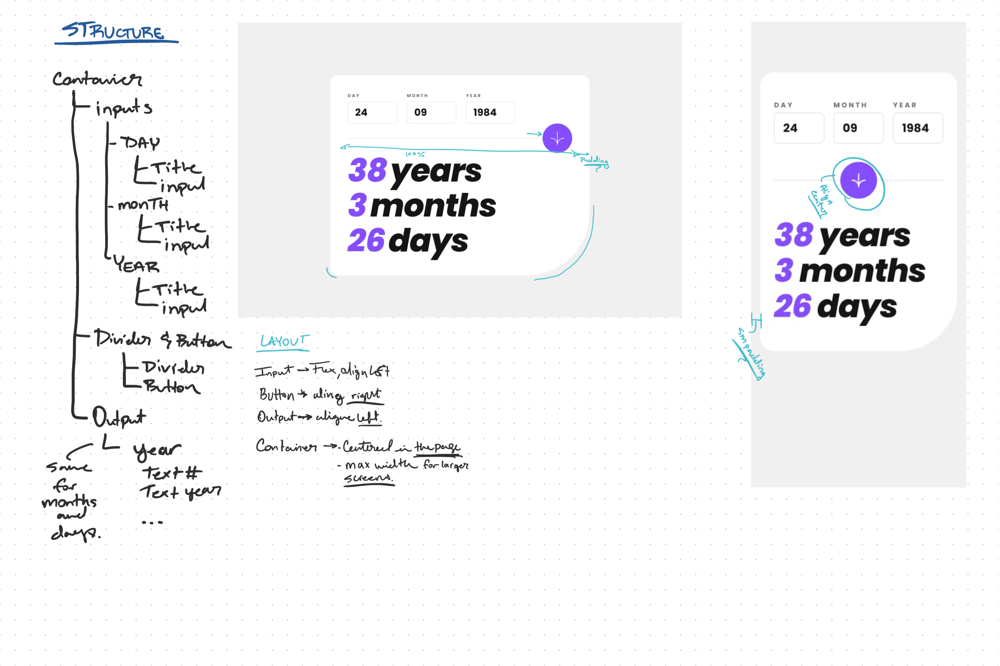

# Frontend Mentor - Age calculator app solution

This is a solution to the [Age calculator app challenge on Frontend Mentor](https://www.frontendmentor.io/challenges/age-calculator-app-dF9DFFpj-Q). Frontend Mentor challenges help you improve your coding skills by building realistic projects. 

## Table of contents

- [Overview](#overview)
  - [The challenge](#the-challenge)
  - [Screenshot](#screenshot)
  - [Links](#links)
- [My process](#my-process)
  - [Built with](#built-with)
  - [What I learned](#what-i-learned)
  - [Continued development](#continued-development)
  - [Useful resources](#useful-resources)
- [Author](#author)
- [Acknowledgments](#acknowledgments)
## Overview

### The challenge

Users should be able to:

- View an age in years, months, and days after submitting a valid date through the form
- Receive validation errors if:
  - Any field is empty when the form is submitted
  - The day number is not between 1-31
  - The month number is not between 1-12
  - The year is in the future
  - The date is invalid e.g. 31/04/1991 (there are 30 days in April)
- View the optimal layout for the interface depending on their device's screen size
- See hover and focus states for all interactive elements on the page
- **Bonus**: See the age numbers animate to their final number when the form is submitted

### Screenshot


### Links
- Live Site URL: [Demo](https://abiel101.github.io/Age-Calculator.io/public/index.html)

## My process
<!-- Explain my over all process on how I managed to brake it down and figure out how to build the website little by little. -->
The most important part of this project was braking things down into smaller pieces so that I was able to quickly build this project.
<br>
First I broke down the design so that I can section off the inputs, button and results. This helped me give each part of the button its own moment of focus. Instead focusing in the project as a whole I broke it down it these three sections to more easily build it with tailwind CSS. I also work on the entire layout as well. In a sense I focus on planning the project more and spent less time building it.
<br>
<br>
Here is a picture of how I broke things down using the design given to me:


### Built with
- HTML 5
- Tailwind CSS
- Javascript
- NodeJS
- GSAP
### What I learned

I learned alot. The first thing I learn is that I need a brush up in my JavaScript which is exactly what I did. I utilized some of the knowledge I had to be able to return data from a function as an array which is how I get the output results. It was a lot of trial an error but definitly a lot of fun seeing where I could improve my skills in javascript.

This was my first project also implementing **GSAP** to my code, it's actually the first animation you see when it loads.

I did a lot of thinking and logging on this project but this has reminded me that this is for me. Coding and building projects is for me.

### Code Highlights

<h3 styles="font-weight:bold">Tailwind CSS</h3>
My First customs Tailwind CSS classes help me create the input and when ever they have an error.

```css
.input{
  @apply border border-borderGray hover:border-accent rounded-md text-2xl font-semibold px-6 py-3 w-full focus:border-accent cursor-pointer outline-none;
}
.error{
  @apply border border-red-500 hover:border-red-500 rounded-md text-2xl font-semibold px-6 py-3 w-full focus:border-accent cursor-pointer outline-none;
}
.text-red{
  @apply text-red-500 translate-x-5;
}
```
<br>
<h3 style=" font-weight: bold;">Javascript</h3>
This variable stores the number of days there are in the month that the user inputs. Once the user clicks enter the value inside this variable gets used to determine whether or not the user inputed the correct amount of days in the specific month they chose.

```javascript
let daysInTheMonth = new Date(inputYear.value, inputMonth.value, 0).getDate(); 

if(inputDay.value > daysInTheMonth){
    errorCheck(inputDay, dayLabel, errorDay);
    errorDay.innerHTML = "Must be a valid day";
  }
```
```javascript
function countUp(currentAgeResults, dateOutPut){
  let output = 0;
  let interval = setInterval(() => {
    if(output == currentAgeResults) {
      dateOutPut.innerHTML = output;
      clearInterval(interval);
      return;
    }
    dateOutPut.innerHTML = output;
    output++;
  },50);
};
```

### Continued development

Over all this project was a great challenge that I was able to take on and test my new tailwind CSS skills. Despite that I did see places where I could improve my skills.
<br>
<br>
For tailwind my focus will be to improve my layout skills. Tailwind CSS prioritize mobile first meaning that it is best to start with mobile and then work you way up to tablet, desktop screen size and larger. Since on my practice projects it has always been desktop first then mobile I will work on improving my skill to work the other way around. 
Then I will also deepen my knowledge in tailwind to utilize other parts of tailwind CSS like creating more custom classes and possibly a themes to have a dark mode and light mode on my next project.
<br>
<br>r
For Javascript, I will aim to not have so many if/else statements. I noticed how I utilized that heavily on this project and although it gave me the solution I wanted there could be better ones. Maybe the way I organize my javascript could also use some improvement as well.

### Useful resources

- <a href="https://dev.to/code_mystery/javascript-age-calculator-calculate-age-from-date-of-birth-o9b" style="color: #9BD076">Javascript Age Calculator</a> - This article by Foolish Developer, helped me to understand how I could get the result for the amount of days.

- <a href="https://tailwindcss.com/docs/installation" style="color: #9BD076">Tailwind CSS Website</a> - This is the resource I used to write my tailwind CSS. Although I have my own notes, there were somethings that I needed to figure out that I didn't have on my notes. The Tailwind CSS website is a pretty amazing resource to quickly find the classes you need for centering, changing colors, etc.

## Author

- Website - <a href="https://abiel-code-dev.webflow.io" style="color: #9BD076">Abiel Ortega</a>
- Frontend Mentor - <a href="https://www.frontendmentor.io/profile/Abiel101" style="color: #9BD076">@Abiel101</a>
- Twitter - <a href="https://www.twitter.com/abielcodedev" style="color: #9BD076">@abielcodedev</a>
